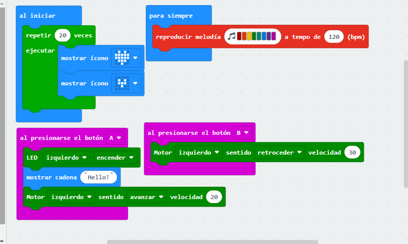

## LOS PRIMEROS PASOS CON MAQUEEN

### Proyecto 1

Robot Maqueen- https://youtube.com/shorts/fWpiG2T9ghw?feature=share

Ponemos que al iniciar repita 20 veces estos iconos que aparecen en el codigo alternando el de abajo, y siempre reproduzca la melodia que hemos creado. Al presionar el boton A le hemos dicho que se enciende la lud led izquierda mostrando el mensaje "Hello" y empieze a andar hacia adelante y si presionamos el boton B va a retroceder.
Ejemplo tenemos en el video de Youtube.

 [modulo2.hex](macqueen.hex)
 
Paula Brito Milan

### Proyecto 2

En este proyecto hemos puesto que al iniciar, se muestre un saludo, y se reproducirá una melodía mientras el maqueen esté en funcionamiento. Otras funciones son que al pulsar el botón (A), se encienda el LED izq y retoceda mientras muestra un icono en la micro:bit. Y al presionar el botón (B) avanzará hacia delante, mientras muestra en la placa micro:bit una flecha

José María Campos Chacón
