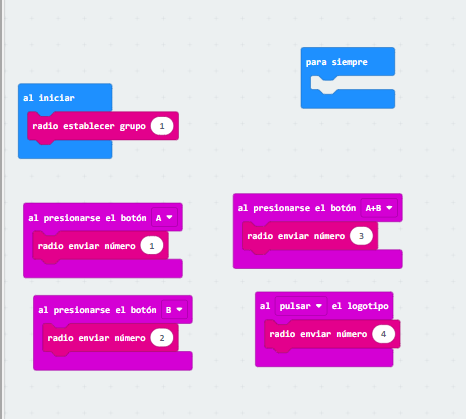
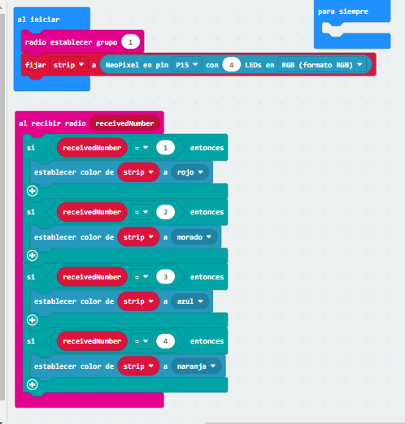

## Ejemplo 1:

Hemos creado un código para que al pusar las distintas teclas de otro microbit, muestren colores distintos los Led del maqueen.
El primer paso sería ingresar a la microbit que utilizaremos como emisora, el código con las instrucciones para que el receptor interprete las diferentes señales que le llegan. El segundo paso crear e introducir el código en la microbit receptora con los distintos colores, y ya funcionaría todo.

Video - https://youtube.com/shorts/NPK_Pm1mCQo?feature=share

### Código radio1

[codigo_radio1](microbit-Radio1.hex)

### Código radio2

[codigo_radio2](microbit-Radio2(1).hex)

#### Ejemplo 1.1: Paula Brito Milan

### Código radio1 

[codigo_radio1](MAQUEN4.hex)

### Código radio2 

[codigo_radio1](MAQUEN41.hex)

VIDEO - https://youtube.com/shorts/AaZwKKuiXhs
