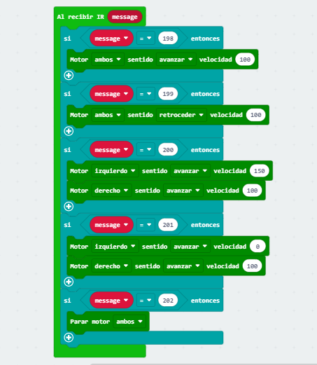

## Proyecto 2:

En este otro ejercicio, a través de un mando con infrarrojos, haremos que nuestro maqueen entre en movimiento. Para ello primero tenemos que saber que frecuencia recibe la microbit con cada botón del mando. Para conseguir esto haremos un programa que al pulsar cualquier botón del mando, nos indique un número con la frecuencia que recibe la microbit. Despúes creamos un programa con los movimientos que va a realizar nuestro robot fijando el número de frecuencia de cada botón con el movimiento a realizar.

Video - https://youtu.be/YQOt2X005QA

### Código radio1

### Código Movimiento

[Código](codigo2.hex)

#### Ejemplo 2.1: Paula Brito Milan

### Código Movimiento 

[Código](MAQUEN42MANDO.hex)

VIDEO - https://youtube.com/shorts/BPVY-GAX9uc?feature=share
