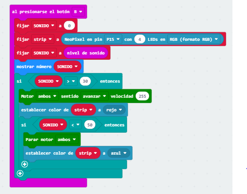

## Proyecto 

### Boton A

#### Sigue las líneas.

En el siguiente proyecto vamos a hacer que cuando pulsemos el boton A nuestro robot detecte las lineas que hay en el suelo con su lector infrarrojos. Si este lector detecta que nuestro robot está fuera de la linea, corregirá su movimiento para que vuelva a estar justo encima. 

### Boton B
En el siguiente bloque utilizaremos el boton b para que nuestro robot utilize el sensor de sonido, donde si el valor del sonido que lo detecta con el sensor de sonido es mayor a 30 le hemos indicado que avanze y nos muestre una luz roja y si el valor del sensor de sonido es inferior a 50 se pare y nos muestre una luz azul. Esto lo comprobaremos con musica, ya que depende del volumen avanzara o se parara.

### Boton A+B

### Mando a distancia

|Botón/Gesto| Acción|Código
| --- | --- | ---
|A+B inclinado hacia arriba|Adelante| 1
|A+B inclinado hacia abajo|Atrás|4
|A|giro a la izquierda|3
|B|Giro a la derecha|2    
|Pantalla cara al suelo|Parar|0
| Agitado | Luces On |5
